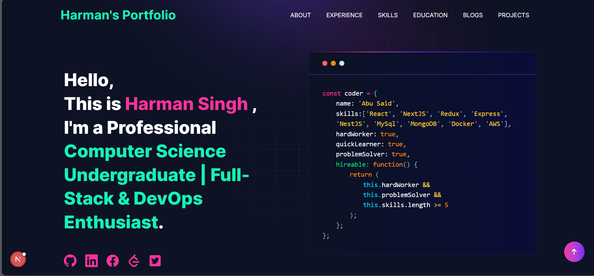

[](https://github.com/hsk-2004/developer-portfolio/actions/workflows/ci.yml)

<p align="center" width="100%">
  <!-- You can replace this with your own logo later -->
  
</p>

<h1 align="center">Harman Singh – Portfolio</h1>

<p align="center">
  <strong>Personal portfolio website showcasing my skills, projects, and experience in Full-Stack Development and DevOps</strong>
</p>

<p align="center">
  
  
  
  
</p>

<p align="center">
  <a href="#overview">Overview</a> •
  <a href="#features-sparkles">Features</a> •
  <a href="#tech-stack-computer">Tech Stack</a> •
  <a href="#installation-arrow_down">Installation</a> •
  <a href="#deployment-rocket">Deployment</a>
</p>

---

## Overview

This repository contains the source code for my **personal portfolio website**, built using modern web technologies to present my professional profile.

The portfolio highlights my:
- Technical skill set
- Selected projects
- Education and experience
- Blog posts fetched from dev.to
- Contact details for professional opportunities

The application is production-ready and containerized using Docker.

---

## Demo :movie_camera:

<p align="center">
  <!-- Replace with your own screenshot if you want -->
  
</p>

<p align="center">
  <strong>Live demo - http://13.203.103.133</strong>
</p>

---

## Features :sparkles:

- ✅ Modern, responsive UI
- ✅ Built with Next.js App Router
- ✅ SEO optimized using Metadata API
- ✅ Image optimization with `next/image`
- ✅ Blog integration from dev.to
- ✅ Contact form with email support
- ✅ Dockerized production setup

---

## Tech Stack :computer:

| Technology | Purpose |
|----------|--------|
| **Next.js 16** | Frontend framework |
| **React 19** | UI library |
| **Tailwind CSS** | Styling |
| **Node.js** | Runtime |
| **Docker** | Containerized deployment |

---

## Installation :arrow_down:

### Prerequisites

- Node.js v18.17+
- Git
- pnpm (recommended)

Verify installation:

```bash
node --version
git --version
pnpm --version
Getting Started
Clone the repository:

bash
Copy code
git clone https://github.com/<your-username>/<your-repo>.git
cd <your-repo>
Install dependencies:

bash
Copy code
pnpm install
Run the development server:

bash
Copy code
pnpm dev
Open:

arduino
Copy code
http://localhost:3000
Customization
All editable portfolio content lives in:

bash
Copy code
utils/data/
Static files such as images, favicon, and resume are located in:

cpp
Copy code
public/
Update your personal details in:

js
Copy code
utils/data/personal-data.js
Deployment :rocket:
Docker (Production)
bash
Copy code
docker build -t portfolio -f Dockerfile.prod .
docker run -d -p 3000:3000 portfolio
This setup can be deployed on:

AWS EC2

Any VPS with Docker

Cloud providers supporting containers

License
This project is licensed under the MIT License.

<p align="center"> This repository reflects my focus on building clean, scalable, and production-ready web applications. </p> ```
